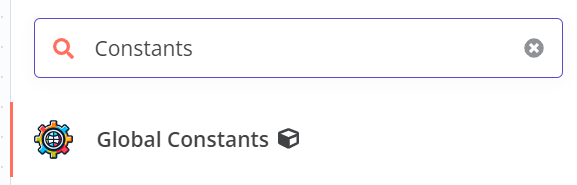
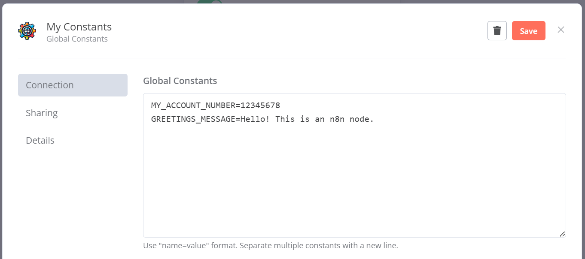
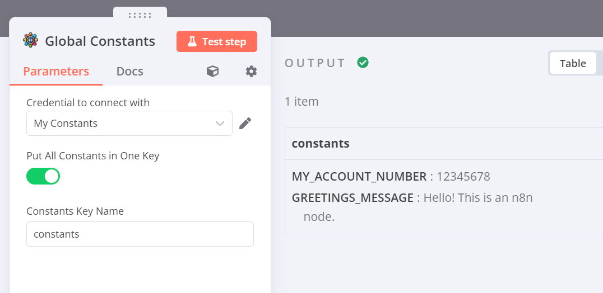

#  n8n-nodes-globals

This is an n8n community node. It lets you create global constants that can be used in any workflow.

* [Installation](#installation)  
* [Usage](#usage)
* [Version history](CHANGELOG.md)  

## Installation

Follow the [installation guide](https://docs.n8n.io/integrations/community-nodes/installation/) in the n8n community nodes documentation.

## Usage

This node uses N8N Credential to store the global variables.

1. Add "`Global Constants`" node to your workflow.
   
2. In the node configuration, either select an existing credential or create a new one.
3. Add the key-value pairs you want to use as global constants.
   
4. Use the global constants in your workflow
	 

